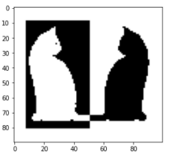
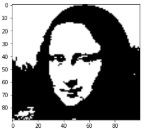

# Hopfield-Neural-Network
This repository contains the implementation of Hopfield Network using Hebbian Learning algorithm. The network is used as auto-associative memory for Image retrieval.

## Implemented Things
* Single Pattern Image retrieval.
* Multiple Pattern Image retrieval.
* Multiple Pattern Image retrieval by making X % of the weight 0.

## Task 1

**Image Visualization**

    
  
