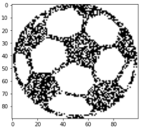
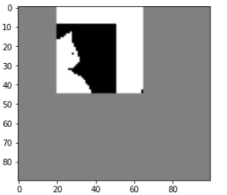

# Hopfield-Neural-Network
This repository contains the implementation of Hopfield Network using Hebbian Learning algorithm. The network is used as auto-associative memory for Image retrieval.

## Implemented Things
* Single Pattern Image retrieval.
* Multiple Pattern Image retrieval.
* Multiple Pattern Image retrieval by making X % of the weight 0.

## Task 1

**Image Visualization**

    

## Task 2
Image of the ball is saved in the network.

**[a] Initialize a zero matrix of the same size as that of the input image of the ball and replace a small patch with a portion of the input image. Use this patch image as the cue for retrieving the image.**

**Image Retrieval**

        

**[b] Plot the Root Mean Squared (RMS) error with time.**

RMS = array([1.26719287, 0.76768049, 0.47702784, 0.2921187 , 0.17888544, 0.11352924, 0.06324555, 0.03651484, 0.00020021])

## Task 3
Save all the three images (Ball, Cat, Monalisa) in the network.

**[a] Give small patches of each image to retrieve the corresponding saved image.**

 

  
